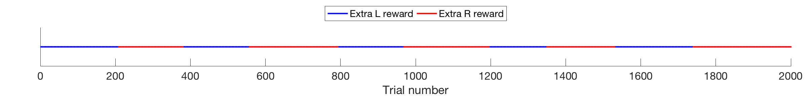
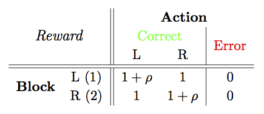

### POMDP

A project building a reinforcement learning algorithm based upon a _partially observable Markov decision process_. 

The ideas used to build the model implemented here are largely drawn from 
* [_Reinforcement Learning: An Introduction_](http://people.inf.elte.hu/lorincz/Files/RL_2006/SuttonBook.pdf) by Richard Sutton and Andrew Barto
* [_Planning and acting in partially observable stochastic domains_](https://doi.org/10.1016/S0004-3702(98)00023-X) by Kaelbling et al. (1998)

Terminology and the majority of the notation are also taken from these sources.

#### The task

Here the agent will be presented with a two-alternative forced decision task. Over a number of trials the agent will be able to choose and then perform an action based upon a given stimulus. The stimulus values range from -1 to 1. When the stimulus value is less than 0, the agent should choose Left to make a correct decision, and when the stimulus value is greater than 0 the agent should choose Right to make a correct decision. If the stimulus value is 0, the correct decision is randomly assigned to be either left or right for the given trial, and the agent will be rewarded accordingly.

The agent is rewarded in an asymmetric manner. For some trials, the agent receives an additional reward for making a left correct action. For the remaining trials, the agent receives an additional reward for making a right correct action. The trials are presented to the agent in blocks.

#### The model

#### The code
